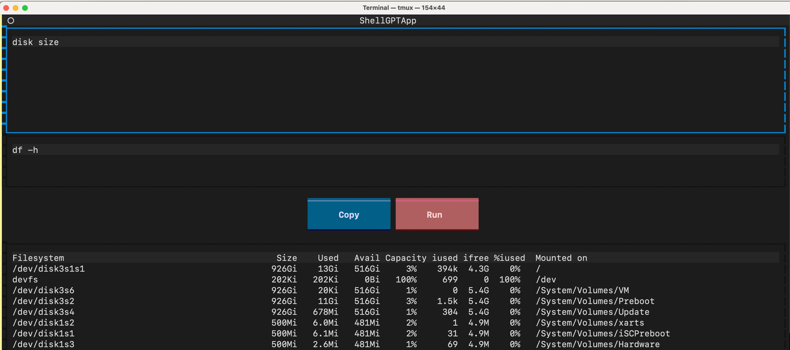

# ShellGPT

[](https://pypi.org/project/shgpt/)

Generate shell command you want with power of LLM, without leaving your terminal!

# Install
```
pip install shgpt
```

This will install two commands: `sg` and `shgpt`.

# Usage

ShellGPT has three modes to use:
- `sg {your question}`, direct mode
- `sg`, Enter TUI mode, tailored for infer shell command
- `sg -r`, Enter an interactive REPL

See [conf.py](shgpt/utils/conf.py) for configs.

## TUI
There are some key bindings to use in TUI:
- `ctrl+j`, Infer answer
- `ctrl+r`, Run command
- `ctrl+y`, Yank command



# Requirements
- [Ollama](https://ollama.com/), you need to download models before try shellgpt.

# License

[GPL-3.0](https://opensource.org/license/GPL-3.0)
